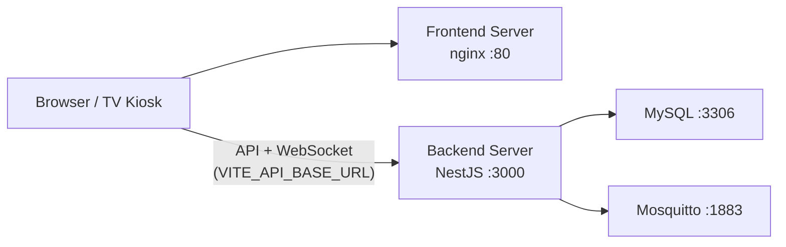

# การ Deploy แยก Server (Frontend / Backend)

โปรเจ็กต์แยกเป็น 2 โฟลเดอร์อิสระ — deploy คนละ IP ได้

```
visual_location/
├── backend/     → API Server (NestJS + MySQL + MQTT)
├── frontend/    → Web Server (React static + nginx)
├── docs/
└── raspi/       → MQTT gateway (Raspberry Pi)
```

---

## สถาปัตยกรรม



- Frontend เป็น static files — **ไม่ proxy API** ใน production
- Browser เรียก Backend โดยตรงผ่าน `VITE_API_BASE_URL` และ `VITE_SOCKET_URL`
- Backend ต้องตั้ง `CORS_ORIGINS` ให้รับ request จาก Frontend server

---

## Backend Server

### ไฟล์ที่ต้อง copy ไป server

```
backend/
├── src/
├── shared/
├── database/
├── docker/
├── package.json
├── Dockerfile
├── .env
└── ...
```

### ติดตั้งและรัน (ไม่ใช้ Docker)

```bash
cd backend
npm install
cp .env.example .env
```

แก้ `.env`:

```env
APP_PORT=3000
DB_HOST=127.0.0.1
DB_NAME=visual_inventory_db
DB_USER=root
DB_PASS=<password>

JWT_ACCESS_SECRET=<random-32-chars-min>
JWT_REFRESH_SECRET=<random-32-chars-min>

# IP หรือ URL ของ Frontend server
CORS_ORIGINS=http://192.168.1.20

MQTT_BROKER_URL=mqtt://127.0.0.1:1883
```

```bash
npm run build
npm run start:prod
```

### รันด้วย Docker (แนะนำ)

```bash
cd backend/docker
cp .env.example .env
```

แก้ `CORS_ORIGINS=http://<FRONTEND_IP>` แล้ว:

```bash
docker compose up -d --build
```

ตรวจสอบ:

```bash
curl http://<BACKEND_IP>:3000/api/v1/health
```

---

## Frontend Server

### ไฟล์ที่ต้อง copy ไป server

```
frontend/
├── src/
├── docker/
├── package.json
├── Dockerfile
└── ...
```

### Build สำหรับ production

```bash
cd frontend
npm install
cp .env.example .env
```

แก้ `.env` **ก่อน build** (ค่า Vite ถูก bake เข้า bundle):

```env
VITE_API_BASE_URL=http://192.168.1.10:3000/api/v1
VITE_SOCKET_URL=http://192.168.1.10:3000
```

```bash
npm run build
# ผลลัพธ์ใน dist/ — นำไปวางบน nginx หรือใช้ Docker
```

### รันด้วย Docker

```bash
cd frontend/docker
cp .env.example .env
# ตั้ง VITE_API_BASE_URL ชี้ไป Backend IP

docker compose up -d --build
```

เปิด `http://<FRONTEND_IP>` ใน browser

---

## ตาราง Environment สรุป

| ฝั่ง | ตัวแปร | ตัวอย่าง |
|------|--------|----------|
| Backend | `CORS_ORIGINS` | `http://192.168.1.20` |
| Backend | `JWT_ACCESS_SECRET` | อย่างน้อย 32 ตัวอักษร |
| Frontend | `VITE_API_BASE_URL` | `http://192.168.1.10:3000/api/v1` |
| Frontend | `VITE_SOCKET_URL` | `http://192.168.1.10:3000` |

---

## Firewall / Network

| Server | พอร์ตที่เปิด |
|--------|-------------|
| Backend | 3000 (API + WebSocket), 3306 (MySQL ภายใน), 1883 (MQTT) |
| Frontend | 80 หรือ 443 (HTTPS) |

Browser ต้องเข้าถึง Backend IP:3000 ได้จากเครือข่ายโรงงาน

---

## แยกเป็น 2 Git Repository (ทางเลือก)

ถ้าต้องการ repo คนละอัน:

1. สร้าง repo `visual-location-backend` — copy โฟลเดอร์ `backend/`
2. สร้าง repo `visual-location-frontend` — copy โฟลเดอร์ `frontend/`
3. Frontend มี `src/shared/` ของตัวเอง (ไม่พึ่ง backend repo)
4. Backend มี `shared/` ของตัวเอง

เมื่อแก้ RBAC/types ต้อง sync ทั้งสองฝั่งด้วยตนเอง

---

## Local development (ทั้งสองฝั่งบนเครื่องเดียว)

```bash
# Terminal 1
cd backend && npm install && npm run start:dev

# Terminal 2
cd frontend && npm install && npm run dev
```

หรือจาก root:

```bash
npm run install:all
npm run backend:dev   # Terminal 1
npm run frontend:dev  # Terminal 2
```

ดูรายละเอียดเพิ่มใน [RUN_GUIDE.md](RUN_GUIDE.md)
