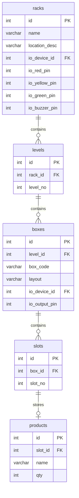
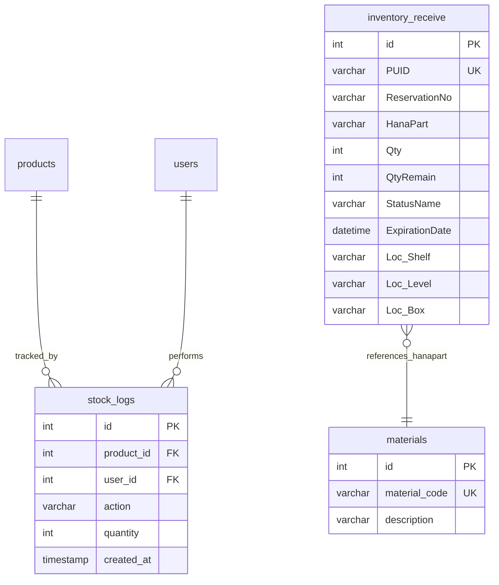
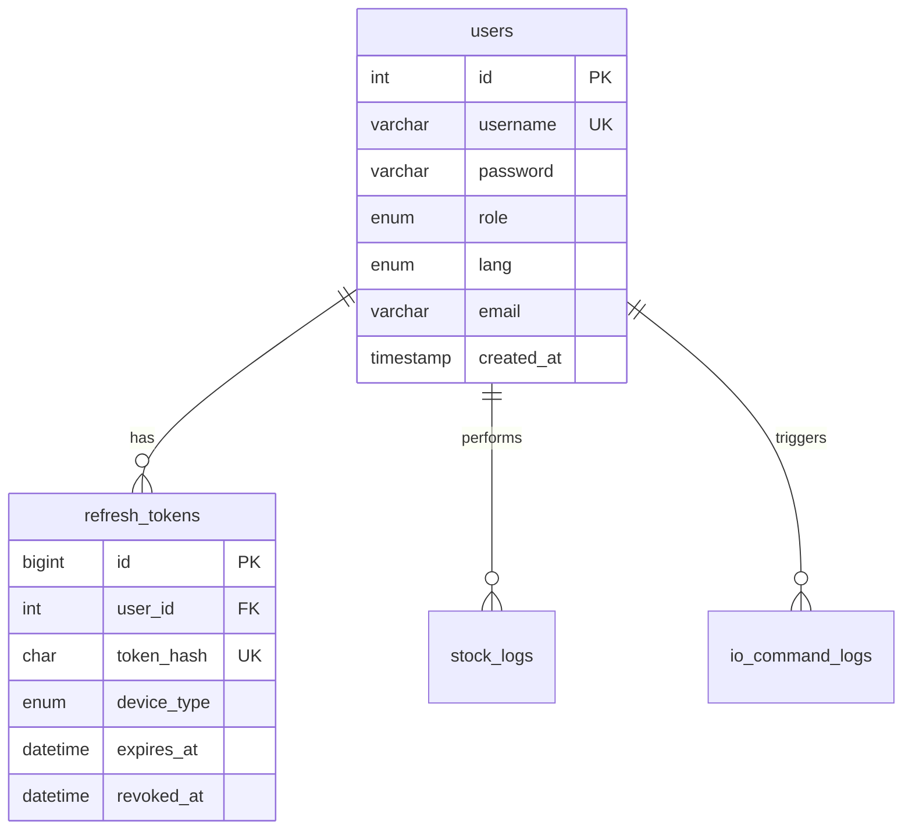
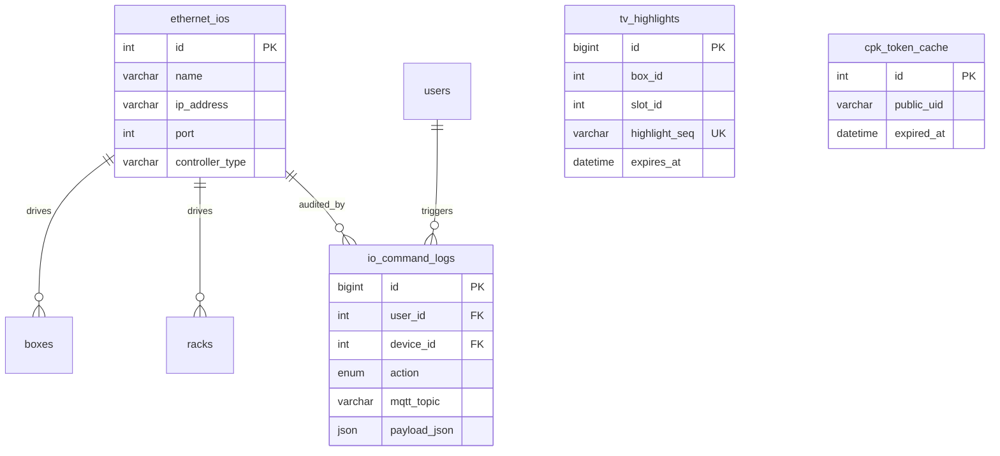
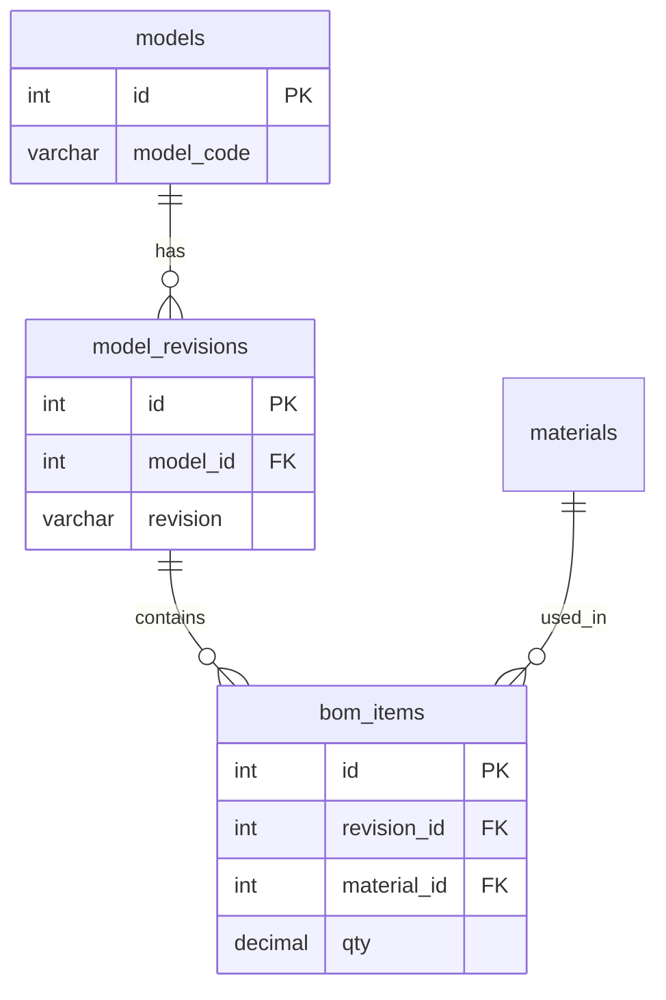

# ER Diagram

Entity-relationship model for Visual Location Management.  
Baseline tables from PHP `visual_inventory_db` plus Phase 1 additive tables.

## Core warehouse hierarchy

## Inventory & audit

## Users & authentication (Phase 1 additive)

## IoT & real-time (Phase 1 additive)

## BOM & production (legacy — retained in DB, not in v1 UI scope)

## Views (read-only)

| View | Joins |
|------|-------|
| `v_inventory_location` | products → slots → boxes → levels → racks + earliest expiration |
| `v_stock_history` | stock_logs → users → products |

## Relationship summary

| Parent | Child | Cardinality | On delete |
|--------|-------|-------------|-----------|
| racks | levels | 1:N | CASCADE (admin) |
| levels | boxes | 1:N | CASCADE |
| boxes | slots | 1:N | CASCADE |
| slots | products | 1:0..1 | CASCADE |
| users | stock_logs | 1:N | RESTRICT |
| users | refresh_tokens | 1:N | CASCADE |
| ethernet_ios | boxes/racks | 1:N | SET NULL |
