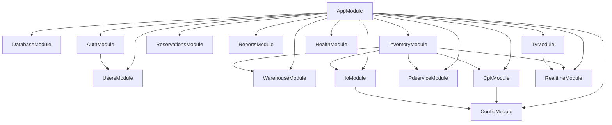

# NestJS Architecture

Backend design for `@visual-location/api`. Phase 1 defines structure; Phase 2 implements modules.

## Overview

```
┌─────────────────────────────────────────────────────────────────┐
│                         NestJS API (:3000)                       │
├─────────────┬──────────────┬──────────────┬─────────────────────┤
│   HTTP REST │  Socket.IO   │    MQTT      │   External HTTP     │
│  /api/v1/*  │  /realtime   │  publisher   │  PDService, CPK     │
└─────────────┴──────────────┴──────────────┴─────────────────────┘
         │              │              │
         ▼              ▼              ▼
    TypeORM/MySQL   React clients   Raspberry Pi
```

## Module dependency graph



## Layered design per module

```
module/
├── *.module.ts          # NestJS wiring
├── *.controller.ts      # HTTP routes, guards, DTO validation
├── *.service.ts         # Business logic
├── entities/            # TypeORM entities
├── dto/                 # class-validator request/response
└── interfaces/          # Internal contracts
```

**Rules:**
- Controllers: thin — validate, authorize, delegate
- Services: all business logic, transactions, external calls
- No direct Modbus/HTTP to Ethernet IO — `IoModule` publishes MQTT only
- CPK token: `CpkTokenService` reads/writes `cpk_token_cache` table

---

## Module specifications

### AuthModule

| Responsibility | Detail |
|----------------|--------|
| Login | bcrypt verify against `users.password` |
| JWT | Access + refresh pair |
| Shift logout | Reject tokens issued before last 07:00/19:00 cutoff |
| Device types | `desktop` (4h), `handheld` (30m), `tv` (kiosk key) |
| Language | PATCH `/auth/me` updates `users.lang` |

**Guards:** `JwtAuthGuard`, `RolesGuard`

**Endpoints:**
```
POST /api/v1/auth/login
POST /api/v1/auth/refresh
POST /api/v1/auth/logout
GET  /api/v1/auth/me
PATCH /api/v1/auth/me
```

### UsersModule

Admin CRUD for `manage_users` screen.

```
GET    /api/v1/users
POST   /api/v1/users
PATCH  /api/v1/users/:id
DELETE /api/v1/users/:id
```

Role guard: `admin` only.

### WarehouseModule

Rack/Level/Box/Slot/Product CRUD + layout resolution.

Port from PHP:
- `warehouse_structure.php` → `WarehouseService.getHierarchy()`
- `box_layout_service.php` → `BoxLayoutService.getLayout(boxId)`

```
GET  /api/v1/warehouse/racks
GET  /api/v1/warehouse/racks/:id
GET  /api/v1/warehouse/boxes/:id/layout
GET  /api/v1/warehouse/boxes/:id/products
CRUD /api/v1/warehouse/admin/{racks,levels,boxes,slots,products}
CRUD /api/v1/io/devices
```

### InventoryModule

Core stock operations.

Port from PHP:
- `inventory_api_service.php` → `PdserviceModule` + location resolve
- `receive_item.php` → `ReceiveService`
- `warehouse_highlight_service.php` → `HighlightService`
- FIFO logic from `request_by_puid.php` / `withdraw_by_workorder.php` patterns

```
GET  /api/v1/inventory/search?q=
GET  /api/v1/inventory/puid/:puid
POST /api/v1/inventory/receive
POST /api/v1/inventory/receive-return
POST /api/v1/inventory/highlight
PATCH /api/v1/inventory/:puid/expiration
```

**Transaction pattern (receive with reservation):**
1. Validate slot + PUID (PDService)
2. `CpkService.resPuidRecv()` — fail-fast
3. BEGIN TRANSACTION
4. INSERT/UPDATE `inventory_receive`
5. UPDATE `products.qty`
6. INSERT `stock_logs`
7. COMMIT
8. `HighlightService.trigger()` → MQTT + Socket.IO

### CpkModule

Port `config/cpk_service.php` exactly. CPK Service v1.0.0.14.

| Endpoint | CPK | Auth body |
|----------|-----|-----------|
| GET version | GetVersion | — |
| GET reservation | GET_RESNoInfo/{keyword} | — |
| POST public-uid | GetPublicUID | McID + StationKey |
| POST receive | RES_PUIDRecv | PublicUID only |
| POST return | UpdatePUIDStatus | PublicUID only |
| POST picklists/open | GetOpenPicklists | PublicUID only |
| POST picklists/detail | GetPicklistDetail | PublicUID + PicklistID |
| POST picklists/issue | IssuePUIDToPicklist | PublicUID only |
| POST picklists/close | ClosePicklist | PublicUID only |
| POST station/inventory | StationInvenCheck | PublicUID only |
| POST cache/clear | ClearCache | PublicUID + ClearTarget (admin) |

**Token service:**
- Cache in `cpk_token_cache` (singleton)
- Auto-refresh on `invalid or expired` message (retry once)
- POST endpoints: **never send McID** in body (per CPK v1.0.0.14)

**Warnings handling:** Return `Warnings[]` to client even when `Status=S`

### PdserviceModule

HTTP client to `PDSERVICE_BASE_URL`. PUID lookup only.

```
GET {base}/GetPUIDInfo/{puid}
```

### ReservationsModule

```
GET /api/v1/reservations
GET /api/v1/reservations/:resNo
```

Combines local `reservation_list` + CPK `GET_RESNoInfo`.

### ReportsModule

```
GET /api/v1/reports/stock-movements
GET /api/v1/reports/expiration
GET /api/v1/reports/expiration/export
GET /api/v1/reports/inventory-receive
```

Uses `v_stock_history` view where applicable.

### TvModule

```
GET    /api/v1/tv/highlight     # TV_KIOSK_KEY or JWT
POST   /api/v1/tv/highlight     # JWT
DELETE /api/v1/tv/highlight     # JWT
```

Writes `tv_highlights` table, emits `highlight:update` via Socket.IO.

### IoModule

**Critical rule:** Backend publishes MQTT only.

Port `io_device_service.php` plan resolution → MQTT payload (same JSON shape as Raspi HTTP API).

```
POST /api/v1/io/highlight
POST /api/v1/io/off
POST /api/v1/io/reset
```

Flow:
1. `IoService.resolveBoxPlan(boxId)` — query boxes/racks IO pins
2. `MqttPublisherService.publish(topic, payload)`
3. `IoCommandLog` insert

MQTT topics (from `@visual-location/shared`):
```
visual/io/{deviceId}/highlight
visual/io/{deviceId}/off
visual/io/reset
```

### RealtimeModule

Socket.IO gateway on same HTTP server.

| Event | Direction | Payload |
|-------|-----------|---------|
| `highlight:update` | server → client | TvHighlightDto |
| `highlight:clear` | server → client | — |
| `picklist:count` | server → client | `{ count: number }` |

Auth: JWT in handshake `auth.token` or TV kiosk key.

### HealthModule

```
GET /api/v1/health
GET /api/v1/health/cpk
GET /api/v1/health/pdservice
```

---

## Cross-cutting concerns

### Guards

| Guard | Use |
|-------|-----|
| `JwtAuthGuard` | All authenticated routes |
| `RolesGuard` | `@Roles('admin', 'material_prep')` |
| `TvKioskGuard` | TV read-only with `X-TV-Kiosk-Key` |
| `IpWhitelistGuard` | TV + 3D routes |

### Configuration (`@nestjs/config`)

Validated at boot via Joi or class-validator config class:

| Namespace | Variables |
|-----------|-----------|
| app | PORT, TIMEZONE, CORS_ORIGINS |
| database | DB_HOST, DB_PORT, DB_NAME, DB_USER, DB_PASS |
| jwt | secrets, expiry per device type |
| cpk | base URL, McID, StationKey, timeouts |
| pdservice | base URL |
| mqtt | broker URL, topic prefix, credentials |
| tv | kiosk key, IP whitelists |

### Error response shape

```json
{
  "status": "error",
  "message": "Human-readable message",
  "code": "INVENTORY_PUID_NOT_FOUND",
  "details": {}
}
```

CPK errors pass through `Message` field from CPK response.

---

## TypeORM entity map

| Entity | Table |
|--------|-------|
| User | users |
| RefreshToken | refresh_tokens |
| Rack | racks |
| Level | levels |
| Box | boxes |
| Slot | slots |
| Product | products |
| InventoryReceive | inventory_receive |
| StockLog | stock_logs |
| ReservationList | reservation_list |
| EthernetIo | ethernet_ios |
| TvHighlight | tv_highlights |
| IoCommandLog | io_command_logs |
| CpkTokenCache | cpk_token_cache |

---

## Phase 2 implementation order

1. `ConfigModule` + `DatabaseModule` + `HealthModule`
2. `AuthModule` + `UsersModule`
3. `WarehouseModule`
4. `PdserviceModule` + `CpkModule`
5. `InventoryModule` + `ReservationsModule`
6. `IoModule` + `RealtimeModule` + `TvModule`
7. `ReportsModule`
