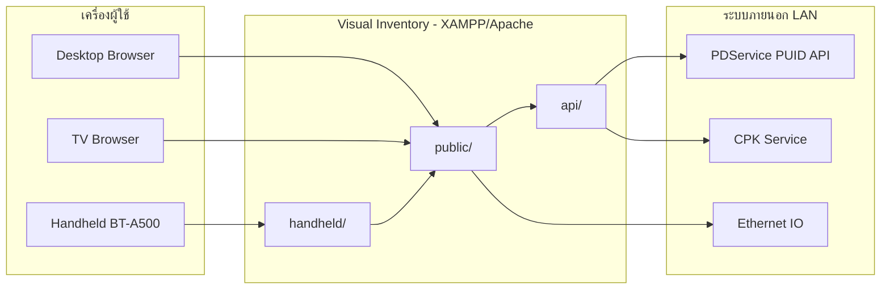

# คู่มือการใช้งาน Visual Inventory (Visual Location Management)

> **ผู้ใช้เป้าหมาย:** พนักงานปฏิบัติการ (Operator), Material Prep, Admin และทีม IT โรงงาน  
> **ภาษา:** ไทย (มีคำศัพท์ภาษาอังกฤษที่จำเป็น)  
> **อัปเดต:** 2026-05-30 — หลัง Phase 1–7

---

## สารบัญ

1. [ภาพรวมระบบ](#1-ภาพรวมระบบ)
2. [ข้อกำหนดเบื้องต้น](#2-ข้อกำหนดเบื้องต้น)
3. [การติดตั้งและตั้งค่า (.env)](#3-การติดตั้งและตั้งค่า-env)
4. [การเข้าใช้งานและบทบาทผู้ใช้](#4-การเข้าใช้งานและบทบาทผู้ใช้)
5. [Desktop Factory UI — หน้าหลักและเมนู](#5-desktop-factory-ui--หน้าหลักและเมนู)
6. [Desktop — หน้างานหลัก (ทีละหน้า)](#6-desktop--หน้างานหลักทีละหน้า)
7. [Handheld KEYENCE BT-A500](#7-handheld-keyence-bt-a500)
8. [จอ TV Display และ 3D Layout](#8-จอ-tv-display-และ-3d-layout)
9. [Maintenance และ CPK Test (IT)](#9-maintenance-และ-cpk-test-it)
10. [การแก้ปัญหาที่พบบ่อย (Troubleshooting)](#10-การแก้ปัญหาที่พบบ่อย-troubleshooting)
11. [สิ่งที่ยังไม่สมบูรณ์ / Follow-up](#11-สิ่งที่ยังไม่สมบูรณ์--follow-up)

---

## 1. ภาพรวมระบบ

**Visual Inventory** (ชื่อเต็ม: Visual Location Management) เป็นระบบคลังสmart warehouse สำหรับโรงงาน ใช้จัดการ:

| ความสามารถ | รายละเอียด |
|------------|------------|
| **PUID / Barcode** | สแกนและติดตามวัสดุด้วย PUID จาก PDService |
| **ตำแหน่ง Rack–Level–Box–Slot** | แสดงตำแหน่งจัดเก็บแบบ Visual พร้อม IO Indicator |
| **BOM / Work Order** | เบิกตาม BOM, สั่งเบิก, จัดการ Production Order |
| **CPK Service** | รับจอง (Reservation), Picklist, อัปเดตสถานะ PUID |
| **Handheld** | UI สำหรับสแกนเนอร์ KEYENCE BT-A500 |
| **TV Display** | จอแสดงตำแหน่งแบบ Real-time บนโรงงาน |
| **รายงาน / วันหมดอายุ** | รายงานสต็อก, ตรวจวันหมดอายุ, แจ้งเตือนทางอีเมล |

### โครงสร้าง URL หลัก

สมมติ `APP_BASE_URL=http://172.31.71.125/visual_inventory` (ปรับตาม IP/โดเมนจริง):

| ส่วน | URL ตัวอย่าง |
|------|--------------|
| หน้า Login Desktop | `{APP_BASE_URL}/public/login` หรือ `{APP_BASE_URL}/login` |
| Dashboard | `{APP_BASE_URL}/public/index` หรือ `{APP_BASE_URL}/index` |
| Handheld | `{APP_BASE_URL}/handheld/` |
| TV Display | `{APP_BASE_URL}/public/tv_display` |
| 3D Layout | `{APP_BASE_URL}/public/layout_3d` |
| CPK Test (IT) | `{APP_BASE_URL}/maintenance/cpk_test.php` |

> Apache `mod_rewrite` จะตัด `.php` และส่ง request ไปที่ `public/` โดยอัตโนมัติ (ดู `.htaccess` ที่ root)

### แผนภาพการเชื่อมต่อ



---

## 2. ข้อกำหนดเบื้องต้น

### ซอฟต์แวร์เซิร์ฟเวอร์

| รายการ | ขั้นต่ำ |
|--------|---------|
| PHP | 8.2+ |
| Database | MariaDB / MySQL |
| Web Server | Apache + `mod_rewrite` (แนะนำ XAMPP) |
| Composer | ติดตั้ง dependencies (`composer install`) |

### เครือข่าย (LAN)

| ระบบ | ค่าเริ่มต้นใน `.env.example` | หมายเหตุ |
|------|-------------------------------|----------|
| **PDService** | `http://194.10.10.89/PDService/Service1.svc/rest` | ดึงข้อมูล PUID / สต็อก |
| **CPK Service** | `http://194.10.10.15/CPKservice/` | Reservation, Picklist |
| **Ethernet IO** | ตั้งค่าใน DB / `config/EthernetIO.php` | ไฟแสดงตำแหน่ง Rack |

เครื่อง Client (PC, Handheld, TV) ต้องอยู่ใน VLAN ที่เข้าถึงเซิร์ฟเวอร์และ API ภายนอกได้

### ฐานข้อมูล

```bash
mysql -u root visual_inventory_db < visual_inventory_db.sql
```

---

## 3. การติดตั้งและตั้งค่า (.env)

### ขั้นตอนติดตั้ง (IT)

1. คัดลอกโปรเจกต์ไปที่ web root เช่น `htdocs/visual_inventory`
2. คัดลอกไฟล์ environment:
   ```bash
   copy .env.example .env
   ```
3. แก้ไข `.env` ตามตารางด้านล่าง
4. รัน `composer install`
5. Import ฐานข้อมูล
6. ตั้ง `APP_ENV=production` บนเซิร์ฟเวอร์จริง (development เฉพาะเครื่อง dev)

### ตัวแปรสำคัญใน `.env`

| ตัวแปร | คำอธิบาย | ค่าตัวอย่าง / หมายเหตุ |
|--------|----------|------------------------|
| `DB_HOST` | โฮสต์ MySQL | `localhost` |
| `DB_NAME` | ชื่อฐานข้อมูล | `visual_inventory_db` |
| `DB_USER` / `DB_PASS` | บัญชี DB | ตั้งตามนโยบาย IT |
| `TIMEZONE` | เขตเวลา | `Asia/Bangkok` |
| `APP_ENV` | โหมดระบบ | **`production`** บนโรงงาน; `development` บน XAMPP dev |
| `APP_BASE_URL` | URL ฐานของแอป | `http://172.31.71.125/visual_inventory` |
| `TV_KIOSK_KEY` | รหัสลับสำหรับ TV อ่าน API | สตริงยาวสุ่ม — ส่งเป็น `?tv_key=` หรือ header `X-TV-Kiosk-Key` |
| `TV_ALLOWED_IPS` | Whitelist IP จอ TV | คั่นด้วย comma; **ว่าง = อนุญาตทุก IP** |
| `LAYOUT_3D_ALLOWED_IPS` | Whitelist IP หน้า 3D | เหมือน TV |
| `PDSERVICE_BASE_URL` | PDService REST | จาก IT โรงงาน |
| `CPK_SERVICE_BASE_URL` | CPK REST ใหม่ | default ใน `.env.example` |
| `CPK_SERVICE_LEGACY_URL` | CPK legacy WCF | ใช้เมื่อ `CPK_USE_LEGACY_URL=true` |
| `CPK_USE_LEGACY_URL` | สลับ legacy URL | `false` / `true` |
| `CPK_MC_ID` | Machine/Station ID | **จำเป็นสำหรับ POST ทุก endpoint ของ CPK** |
| `CPK_STATION_KEY` | Station GUID | ใช้กับ `GetPublicUID` |
| `MAIL_*` | SMTP สำหรับแจ้งหมดอายุ | ใช้กับ `scripts/notify_expiry.php` |

### โหมด Production vs Development

| โหมด | พฤติกรรม |
|------|----------|
| `production` | บล็อก maintenance scripts อันตราย; `cpk_test.php` ใช้ได้เฉพาะ **admin ที่ login แล้ว** |
| `development` | เปิด dev tools (`public/test_api.php`, maintenance migration ฯลฯ) สำหรับผู้ใช้ที่ login |

### Scheduled Task (แจ้งหมดอายุ)

```bash
php scripts/notify_expiry.php
```

ตั้งใน Windows Task Scheduler หรือ cron — ต้องตั้ง `MAIL_*` ให้ครบ

---

## 4. การเข้าใช้งานและบทบาทผู้ใช้

### 4.1 Login Desktop

1. เปิด `{APP_BASE_URL}/login`
2. กรอก **Username** และ **Password**
3. ระบบพาไปหน้า Dashboard (`index`)

### 4.2 บทบาท (Role)

| Role | สิทธิหลัก |
|------|-----------|
| **user** | ค้นหา, เบิกตาม Work Order, สั่งเบิก BOM/PUID, รายงาน, ตรวจหมดอายุ |
| **material_prep** | สิทธิ user + รับเข้า (Add Stock), จัดการ Reservation, Production Order, Picklist, Handheld Add/Receive |
| **admin** | สิทธิทั้งหมด + จัดการผู้ใช้, BOM/Material, TV/3D, Special Withdraw, Admin panel |

Admin จัดการผู้ใช้ที่ `{APP_BASE_URL}/manage_users`

### 4.3 Session และ Timeout

| ช่องทาง | Idle timeout | Shift timeout |
|---------|--------------|---------------|
| **Desktop** | 4 ชั่วโมง | บังคับ logout หลัง **07:00** และ **19:00** หาก login ก่อน cutoff |
| **Handheld** | **30 นาที** | เหมือน Desktop (07:00 / 19:00) |

เมื่อหมดเวลา ระบบ redirect ไป login พร้อมพารามิเตอร์ `?timeout=1&reason=idle` หรือ `reason=shift`

---

## 5. Desktop Factory UI — หน้าหลักและเมนู

### 5.1 หน้า Dashboard (`index`)

- แสดงสถิติจำนวนสินค้า / Box / คำสั่งรอจัด
- เมนูการ์ด (Module cards) ตามสิทธิ role
- ลิงก์ **Handheld Scanner** ไป `{APP_BASE_URL}/handheld/`
- สลับภาษา **TH | EN** ที่แถบด้านบน
- ออกจากระบบที่ปุ่ม Logout

### 5.2 ธีม UI (Phase 5)

หน้าหลักส่วนใหญ่ใช้ **`public/assets/factory.css`** + `layout_header.php` / `layout_footer.php`

> หน้า login, TV, 3D, และบางหน้า utility ยังใช้ UI แยก — ดู [ส่วนที่ 11](#11-สิ่งที่ยังไม่สมบูรณ์--follow-up)

---

## 6. Desktop — หน้างานหลัก (ทีละหน้า)

### 6.1 ค้นหาสินค้า / ตำแหน่ง — `search_product`

**ผู้ใช้:** ทุก role  
**URL:** `{APP_BASE_URL}/search_product`

**ขั้นตอน:**

1. กรอกชื่อสินค้า (Product name) แล้วค้นหา
2. ระบบแสดง Rack → Level → Box → Slot และจำนวนคงเหลือ
3. หาก Box มี IO ตั้งค่าไว้ ระบบสั่งเปิดไฟ Indicator อัตโนมัติ
4. จอ TV (หากเปิดอยู่) จะ highlight ตำแหน่งที่ค้นหา

---

### 6.2 รับเข้าสต็อก — `add_stock`

**ผู้ใช้:** admin, material_prep  
**URL:** `{APP_BASE_URL}/add_stock`

**ขั้นตอน:**

1. สแกนหรือกรอก **PUID**
2. กดดึงข้อมูลจาก PDService (Get Data)
3. ตรวจสอบ Part, IM, ตำแหน่ง Rack
4. ยืนยันรับเข้า — บันทึกลงฐานข้อมูลและอัปเดตสต็อก

> Handheld ใช้ logic เดียวกันผ่าน `handheld/add_stock.php`

---

### 6.3 คำนวณวัตถุดิบตาม WO — `wo_material_calc`

**ผู้ใช้:** ทุก role (ตาม flow การผลิต)  
**URL:** `{APP_BASE_URL}/wo_material_calc`  
(URL เดิม `withdraw_by_workorder` จะ redirect มาหน้านี้)

**ขั้นตอน:**

1. กรอกหรือสแกน Work Order
2. ระบบโหลด BOM จาก CPK (`GET_WOBOMInfo`)
3. ระบุจำนวนผลิต — คำนวณความต้องการรวมเทียบสต็อก Sub store
4. กด **ค้นหา** ที่แต่ละพาร์ทเพื่อแสดงตำแหน่งบน TV / 3D (ไม่ใช่หน้าเบิกสินค้า)

---

### 6.4 เบิกพิเศษ (ข้าม FIFO) — `withdraw_special`

**ผู้ใช้:** **admin เท่านั้น**  
**URL:** `{APP_BASE_URL}/withdraw_special`

ใช้เมื่อ IT/Admin อนุมัติให้เบิกโดยไม่ตรวจ FIFO — ควรบันทึกเหตุผลตาม SOP โรงงาน

---

### 6.5 สั่งเบิกด้วย BOM — `request_by_bom`

**ผู้ใช้:** admin, user  
**URL:** `{APP_BASE_URL}/request_by_bom`

สร้างคำขอเบิกวัสดุตาม BOM สำหรับไลน์ผลิต (ไม่ใช่การเบิกทันที)

---

### 6.6 สั่งเบิกด้วย PUID — `request_by_puid`

**ผู้ใช้:** admin, user  
**URL:** `{APP_BASE_URL}/request_by_puid`

สแกน PUID เดิมเพื่อขอวัสดุทดแทน

---

### 6.7 จัดการ Reservation / API Data — `show_api_data`

**ผู้ใช้:** admin, material_prep  
**URL:** `{APP_BASE_URL}/show_api_data`

ดูและจัดการข้อมูล Reservation จาก PDService/CPK

---

### 6.8 จัดการ Production Orders — `manage_production_orders`

**ผู้ใช้:** admin, material_prep  
**URL:** `{APP_BASE_URL}/manage_production_orders`

- ดูคำสั่งผลิตที่รอ Material Prep จัดของ
- Badge บน Dashboard แสดงจำนวนคำสั่งค้าง

---

### 6.9 จ่ายตาม Picklist (CPK) — `picklist_issue`

**ผู้ใช้:** admin, material_prep  
**URL:** `{APP_BASE_URL}/picklist_issue`

**ขั้นตอน:**

1. ระบบโหลด Open Picklists จาก CPK (`GetOpenPicklists`)
2. เลือก Picklist → ดูรายละเอียด (`GetPicklistDetail`)
3. สแกน PUID แล้วจ่าย (`IssuePUIDToPicklist`)
4. ตรวจสอบ Operator จาก username ที่ login

**ต้องตั้ง:** `CPK_MC_ID`, `CPK_STATION_KEY` ใน `.env`

---

### 6.10 ภาพรวม Rack — `dashboard_rack`

**ผู้ใช้:** ทุก role  
**URL:** `{APP_BASE_URL}/dashboard_rack`

แสดงสถานะ Rack/Box แบบ Visual grid

---

### 6.11 รายงานสต็อก — `report_stock`

**ผู้ใช้:** ทุก role  
**URL:** `{APP_BASE_URL}/report_stock`

รายงานสต็อกคงเหลือ — ค้นหา/กรอง/พิมพ์ตามหน้าจอ

---

### 6.12 ตรวจวันหมดอายุ — `check_expiration`

**ผู้ใช้:** ทุก role  
**URL:** `{APP_BASE_URL}/check_expiration`

กรอง: หมดอายุแล้ว / ใกล้หมดอายุ (7 วัน) / ปกติ

---

### 6.13 จัดการ BOM / Material (Admin)

| หน้า | URL | หน้าที่ |
|------|-----|---------|
| จัดการ Material | `add_material` | เพิ่ม/แก้ material |
| ดู BOM | `view_bom` | รายการ BOM |
| เพิ่ม BOM | `add_bom` | สร้าง BOM |
| รายละเอียด BOM | `view_bom_detail` | ดูรายการใน BOM |
| Import CSV | `import_bom_csv`, `import_materials_csv` | นำเข้าข้อมูล |
| Export Material | `export_materials` | ดาวน์โหลด CSV (admin) |

---

### 6.14 Admin Panel — `admin`

**ผู้ใช้:** admin  
**URL:** `{APP_BASE_URL}/admin`

จัดการโครงสร้างคลัง: Rack, Level, Box, Slot, IO mapping ฯลฯ

---

### 6.15 จัดการผู้ใช้ — `manage_users`

**ผู้ใช้:** admin  
**URL:** `{APP_BASE_URL}/manage_users`

- เพิ่ม/แก้/ลบ user
- กำหนด role: `user`, `material_prep`, `admin`
- ตั้งรหัสผ่าน (hash ด้วย bcrypt)

---

### 6.16 รายการรับเข้า — `view_inventory_receive`

**ผู้ใช้:** admin  
**URL:** `{APP_BASE_URL}/view_inventory_receive`

ค้นหาประวัติรับเข้าจากตาราง `inventory_receive`

---

### 6.17 เครื่องมือ IT บน Desktop

| หน้า | URL | หมายเหตุ |
|------|-----|----------|
| ทดสอบ PDService | `test_net.php` | ต้อง login |
| ทดสอบ IO | `test_io.php` | admin / dev |
| Health Handheld API | `handheld_health.php` | JSON — ตรวจ PDService |
| UI Preview | `ui_preview` | admin — ดู design system |

---

## 7. Handheld KEYENCE BT-A500

### 7.1 URL และการเข้าใช้

| รายการ | ค่า |
|--------|-----|
| URL หลัก | `{APP_BASE_URL}/handheld/` |
| Login | `{APP_BASE_URL}/handheld/login` |
| อุปกรณ์ | KEYENCE BT-A500 (หรือ browser มือถือใน LAN) |

### 7.2 Login Handheld

1. เปิด `{APP_BASE_URL}/handheld/login`
2. **สแกนบาร์โค้ดรหัสผ่าน** (หรือพิมพ์)
   - Fast path: สแกน Employee ID (ตัวเลข 4–10 หลัก) ถ้า username = รหัสและ password hash ตรง
   - Fallback: ระบบตรวจ password กับ user ทุกคนในฐานข้อมูล
3. หลัง login ไปเมนู `index` หรือหน้าที่ระบุใน `?next=`

### 7.3 เมนู Handheld (`handheld/index.php`)

| ปุ่ม | สิทธิ | หน้าที่ |
|------|-------|---------|
| **Add Stock** | admin, material_prep | รับเข้า — สแกน PUID + location |
| **Withdraw Stock** | ทุก role ที่ login | เบิก — validate แล้ว confirm |
| **Receive Reservation** | admin, material_prep | รับ PUID จาก Reservation (CPK) |
| **Logout** | ทุกคน | ออกจากระบบ |

### 7.4 Add Stock (Handheld)

**URL:** `{APP_BASE_URL}/handheld/add_stock`

1. สแกน **PUID**
2. กด **Get Data** — เรียก PDService ผ่าน `public/get_inventory_proxy.php`
3. ตรวจ Part / IM / Rack
4. สแกนตำแหน่ง (ถ้าต้องการ) แล้ว Submit
5. Logic หลัก reuse จาก `public/add_stock.php` (HANDHELD_POST)

### 7.5 Withdraw Stock (Handheld)

**URL:** `{APP_BASE_URL}/handheld/withdraw_stock`

1. สแกน **PUID**
2. กด **Validate Stock**
3. ตรวจ Available qty
4. กด **Confirm Withdraw**

### 7.6 Receive Reservation (Handheld)

**URL:** `{APP_BASE_URL}/handheld/receive_reservation`

1. สแกน PUID จาก Reservation
2. ระบบเรียก CPK `RES_PUIDRecv` ก่อน commit DB (ผ่าน `api/receive_item.php`)

### 7.7 Logout และ Timeout

| เหตุการณ์ | พฤติกรรม |
|-----------|----------|
| กด Logout | ไป `handheld/logout` → `handheld/login` |
| Idle 30 นาที | `handheld-idle.js` redirect ไป `logout?timeout=1&reason=idle` |
| Shift change 07:00 / 19:00 | `session_check.php` บังคับ logout ทุก channel |

### 7.8 ตรวจสุขภาพ PDService (IT)

```http
GET {APP_BASE_URL}/public/handheld_health.php
```

(ต้อง login session) — คืน JSON สถานะการเชื่อมต่อ PDService

---

## 8. จอ TV Display และ 3D Layout

### 8.1 TV Display

**URL:** `{APP_BASE_URL}/public/tv_display`  
**Login:** ไม่ต้อง login (ออกแบบสำหรับ kiosk)

**การตั้งค่าความปลอดภัย:**

1. ตั้ง `TV_KIOSK_KEY` ใน `.env` (สตริงยาวสุ่ม)
2. ตั้ง `TV_ALLOWED_IPS` เป็น IP ของ PC/TV ในวงโรงงาน (แนะนำ)
3. TV เรียก API read-only พร้อม key:
   - `get_box_layout.php?tv_key=...`
   - `api_tv_highlight.php?action=get&tv_key=...`

**การ highlight จาก Desktop:**

- ผู้ใช้ที่ login ค้นหาที่ `search_product` → ระบบ push highlight ผ่าน `api_tv_highlight.php?action=set` (ต้อง session)

### 8.2 3D Layout

**URL:** `{APP_BASE_URL}/public/layout_3d`  
**Login:** ต้อง login + ตรวจ `LAYOUT_3D_ALLOWED_IPS` (ถ้าตั้งค่า)  
**Admin:** ลิงก์จาก Dashboard (เปิด tab ใหม่)

ใช้ Babylon.js (lazy load ใน Phase 7) แสดง Rack 3D และ highlight ตำแหน่ง

---

## 9. Maintenance และ CPK Test (IT)

### 9.1 CPK Test

| รายการ | ค่า |
|--------|-----|
| URL | `{APP_BASE_URL}/maintenance/cpk_test.php` |
| Auth | Login + **admin** (production) หรือ user ใดก็ได้ (development) |
| ทดสอบ | GetVersion, GET_RESNoInfo (optional `?res_no=`), GetPublicUID |

**ตัวอย่าง:**

```
http://localhost/visual_inventory/maintenance/cpk_test.php
http://localhost/visual_inventory/maintenance/cpk_test.php?res_no=0010012345
```

### 9.2 Maintenance scripts อื่น (26 ไฟล์)

อยู่ใน `maintenance/` — ส่วนใหญ่ใช้ `maintenance_dev_admin_guard()`:

- **Production:** บล็อกแม้ admin จะ login
- **Development:** ต้อง login + admin

| ประเภท | ตัวอย่างไฟล์ |
|--------|--------------|
| CPK test (production OK) | `cpk_test.php` |
| Dev test API | `test_api.php`, `test_api_connection.php` |
| DB migration/fix | `migrate_block_to_slot.php`, `fix_schema.php`, `dump_schema.php` |

### 9.3 Scripts CLI

โฟลเดอร์ `scripts/` ถูกบล็อกจาก web (`.htaccess`) — รันผ่าน CLI เท่านั้น:

```bash
php scripts/notify_expiry.php
php scripts/test_mail.php
```

### 9.4 API Gateway (CPK Proxy)

Desktop เรียก CPK ผ่าน:

```
{APP_BASE_URL}/public/api_gateway.php?call=cpk/get_version.php
```

รายการ endpoint ครบใน `README.md` ส่วน CPK Service

---

## 10. การแก้ปัญหาที่พบบ่อย (Troubleshooting)

### 10.1 Login ไม่ได้ / Session หลุดบ่อย

| อาการ | สาเหตุที่เป็นไปได้ | วิธีแก้ |
|-------|-------------------|---------|
| Redirect login ทันที | Session cookie path/domain ไม่ตรง | ตรวจ `APP_BASE_URL`, cookie path `/` |
| Logout หลัง 07:00/19:00 | Shift timeout | Login ใหม่ — เป็นพฤติกรรมปกติ |
| Handheld logout 30 นาที | Idle timeout | สแกน/กดหน้าจอเป็นระยะ หรือ login ใหม่ |
| JSON API 401 | Session หมด | Login desktop/handheld ใหม่ |

### 10.2 PDService ไม่ตอบ

1. Ping IP `194.10.10.89` จากเซิร์ฟเวอร์
2. เปิด `{APP_BASE_URL}/test_net.php` (login)
3. Handheld: เรียก `handheld_health.php`
4. ตรวจ `PDSERVICE_BASE_URL` ใน `.env`

### 10.3 CPK Error / GetPublicUID FAIL

1. ตรวจ `CPK_MC_ID` และ `CPK_STATION_KEY`
2. เปิด `maintenance/cpk_test.php` (admin)
3. ลอง `CPK_USE_LEGACY_URL=true` หาก IT ยังใช้ legacy WCF
4. ตรวจ firewall ไป `194.10.10.15`

### 10.4 TV ไม่แสดง / API 403

1. ตั้ง `TV_KIOSK_KEY` ใน `.env`
2. ส่ง `tv_key` ใน query ทุก fetch จาก TV page
3. ตรวจ `TV_ALLOWED_IPS` — IP TV ต้องอยู่ใน list
4. วาง TV ใน VLAN โรงงาน

### 10.5 IO ไม่ติด

1. ตรวจ mapping ใน Admin panel
2. ทดสอบ `test_io.php`
3. ตรวจ `config/EthernetIO.php` และ network ไปอุปกรณ์ IO

### 10.6 ฟอนต์/ไอคอนหาย (Offline LAN)

Phase 2 ย้าย Font Awesome และ Google Fonts มา local ที่ `public/plugins/` — ไม่ต้องพึ่ง internet  
ถ้ายังหาย: ตรวจ path `plugins/font-awesome/` และ `plugins/google-fonts/fonts.css`

### 10.7 Maintenance 403 Forbidden

- Production + script migration → **ถูกต้อง** (blocked by design)
- ใช้ `cpk_test.php` สำหรับทดสอบ CPK บน production
- ตั้ง `APP_ENV=development` เฉพาะเครื่อง dev

---

## 11. สิ่งที่ยังไม่สมบูรณ์ / Follow-up

รายการต่อไปนี้ **ยังไม่ได้ทำ** หรือทำบางส่วน — ไม่ควรถือว่าโปรเจกต์ “100% สมบูรณ์” ด้าน security/testing:

| รายการ | สถานะ | ผลกระทบ |
|--------|-------|---------|
| **PHPUnit / automated tests** | ยังไม่มี | QA ต้องทดสอบ manual ตาม checklist |
| **CSRF protection** | ยังไม่มี | Forms POST ยังไม่มี token — ควรใช้ใน LAN ที่ควบคุมได้ |
| **add_stock N+1 query** | ยังไม่แก้ | อาจช้าเมื่อข้อมูลมาก |
| **UI factory.css ครบทุกหน้า** | ~27 หน้าแล้ว | login, TV, 3D, view_inventory_receive, test_* ยัง UI เก่า/แยก |
| **Inline CSS บางหน้า** | คงเหลือ (เช่น index dashboard) | polish ภายหลัง |
| **style.css legacy** | เกือบเลิกใช้ | `head.php` ยังรองรับ `$include_style_css` |
| **check_expiration SQL** | บาง query ใช้ string concat | ควร migrate เป็น prepared statement |
| **`maintenance/withdraw_ajax.php`** | มีแค่ `session_check` ไม่มี `maintenance_guard` | user login ทั่วไปเบิกผ่าน URL นี้ได้ใน production — ควร guard หรือย้ายไป `api/` |

### สรุปความพร้อมใช้งาน (ประเมินหลัง Phase 7)

| ด้าน | ประมาณ |
|------|--------|
| ฟังก์ชันหลักโรงงาน (PUID, เบิก, รับ, Picklist, Handheld, TV) | **~90%** |
| Security hardening | **~75%** (auth/session/TV key ดีขึ้น; ยังไม่มี CSRF) |
| UI/UX consistency | **~80%** (factory.css rollout หลักเสร็จ) |
| Test automation | **~20%** (manual QA เป็นหลัก) |
| **รวมโดยประมาณ** | **~85%** — **พร้อม UAT บนโรงงาน** หากทดสอบตาม [TEST_CHECKLIST_TH.md](TEST_CHECKLIST_TH.md) |

---

## ภาคผนวก — โครงสร้างโฟลเดอร์

| โฟลเดอร์ | หน้าที่ |
|----------|---------|
| `public/` | UI หลัก Desktop |
| `handheld/` | UI สแกนเนอร์ |
| `api/` | JSON API |
| `config/` | DB, session, services |
| `maintenance/` | เครื่องมือ IT (guarded) |
| `scripts/` | Cron/CLI |
| `languages/` | th.php, en.php |

ดูเพิ่ม: [PROJECT_STANDARDS.md](../PROJECT_STANDARDS.md), [README.md](../README.md)
